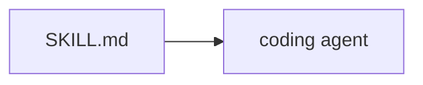
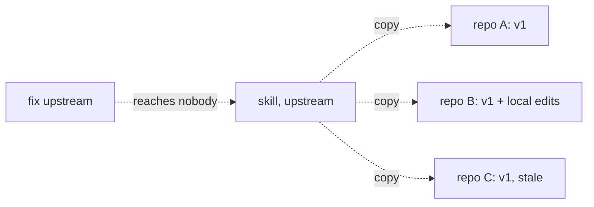
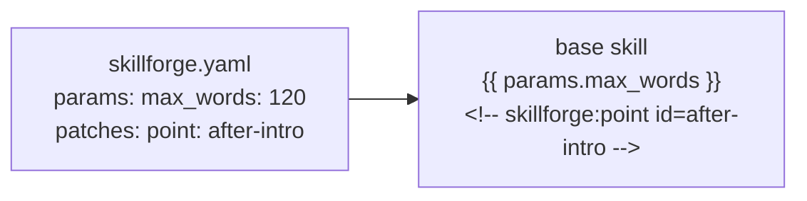
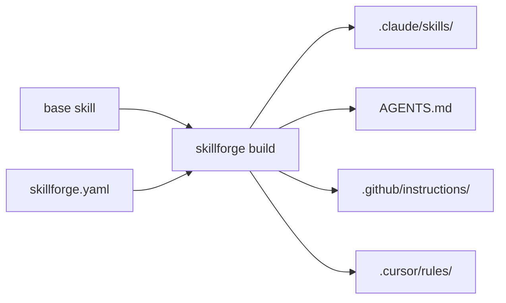
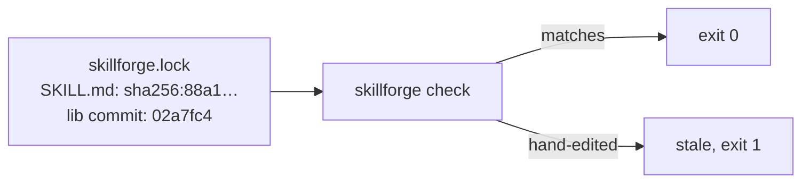

# skillforge

A versioned library of portable AI agent skills, plus a composition layer that lets other
repositories import those skills, configure them, extend them, and add their own.

Skills are written once in the open [Agent Skills](https://agentskills.io) directory format
(`SKILL.md` + bundled files). Consumers do not fork them. They declare what they want in a
`skillforge.yaml`, and skillforge renders skills tailored to that repo for every agent harness
the repo uses.

```
skills/<name>/SKILL.md          the base skill, plain and directly usable
        ↓  params, anchors, patches from skillforge.yaml
.agents/skills/sf-<name>/       the rendered artifact, committed
        ↓  adapters
.claude/skills/  AGENTS.md  .github/instructions/  .cursor/rules/   ~/.claude/skills/
```

## What it is for

An agent skill is usually 90% general and 10% specific to your repo: the test command, the
languages you actually use, the rule your team argued about once. Copying a skill into every
repo means that 90% drifts. Importing it and patching the 10% means it does not.

## Quickstart, as a consumer

```bash
uvx --from git+https://github.com/ya222/skillforge skillforge init
```

It opens the new `skillforge.yaml` in your editor. Fill it in:

```yaml
version: 1

sources:
  lib:
    git: https://github.com/ya222/skillforge
    ref: main

skills:
  - from: lib/eli5
    params:
      audience: a new hire on their first day
      max_words: 300
    patches:
      - point: after-intro
        op: insert
        content: "> Assume the reader has seen our architecture diagram and nothing else."

targets:
  claude-code: {}
  agents-md: {}

output: .agents/skills
```

```bash
uvx --from git+https://github.com/ya222/skillforge skillforge build
git add . && git commit -m "add skillforge skills"
```

Rendered output is committed, so anyone cloning the repo gets working skills without
installing anything. Every rendered skill is prefixed `sf-`, so `lib/eli5` is `/sf-eli5` in
Claude Code, and skillforge never touches anything without that prefix.

To install skills user-wide instead, so Claude Code loads them in every project on your
machine, set `claude-code: { user: true }` under `targets:`. That writes to `~/.claude/skills/`
alongside whatever you keep there by hand. Init that config from a dotfiles repo, not a project;
see [docs/adapters.md](docs/adapters.md), "Setting up a user-wide config".

See [docs/consuming-skills.md](docs/consuming-skills.md) for the full configuration reference.

## Quickstart, as an author

Skills live in [`skills/`](skills/). A base skill is a normal `SKILL.md` that declares its
params and marks the passages consumers are allowed to change. See
[docs/authoring-skills.md](docs/authoring-skills.md).

## Skills in this library

| Skill | What it does |
| --- | --- |
| [`eli5`](skills/eli5/SKILL.md) | Explain a topic with big pictures and few words |
| [`eli12`](skills/eli12/SKILL.md) | Explain a topic with real words, cause and effect, and something to try |
| [`isometric-system-map`](skills/isometric-system-map/SKILL.md) | Draw a codebase's infrastructure as an isometric map, citing files |
| [`dev-style`](skills/dev-style/SKILL.md) | Write developer docs in the Google developer documentation style |
| [`handoff`](skills/handoff/SKILL.md) | Compact the conversation into a handoff document for the next agent |
| [`grill-me`](skills/grill-me/SKILL.md) | Interview the user about a plan until nothing is silently assumed |
| [`frontend-design`](skills/frontend-design/SKILL.md) | Distinctive, intentional visual design for new or reshaped UI |
| [`skill-creator`](skills/skill-creator/SKILL.md) | Create, evaluate, and improve skills, with bundled eval tooling |
| [`architecture-designer`](skills/architecture-designer/SKILL.md) | Design a system, choose patterns, write ADRs, with bundled reference guides |
| [`architect-review`](skills/architect-review/SKILL.md) | Review a design or major change for architectural integrity |

`eli5` is adapted from [anthropics/claude-plugins-community](https://github.com/anthropics/claude-plugins-community)
under the Apache-2.0 licence; attribution travels with the rendered output and the licence text
is in [LICENSES/Apache-2.0.txt](LICENSES/Apache-2.0.txt). `dev-style` condenses the
[Google developer documentation style guide](https://developers.google.com/style), CC BY 4.0. `handoff` and `grill-me` are
adapted from [mattpocock/skills](https://github.com/mattpocock/skills), `architecture-designer` from
[Jeffallan/claude-skills](https://github.com/Jeffallan/claude-skills), and `architect-review` from
[rmyndharis/antigravity-skills](https://github.com/rmyndharis/antigravity-skills), all MIT. `frontend-design` and
`skill-creator` are from [anthropics/skills](https://github.com/anthropics/skills), Apache-2.0, with the
licence bundled alongside each.

## Documentation

| Document | For |
| --- | --- |
| [docs/concepts.md](docs/concepts.md) | The model: bases, params, anchors, patches, layers, targets |
| [docs/authoring-skills.md](docs/authoring-skills.md) | Writing a base skill |
| [docs/consuming-skills.md](docs/consuming-skills.md) | `skillforge.yaml` reference |
| [docs/adapters.md](docs/adapters.md) | What each harness gets, and how to add one |
| [docs/cli.md](docs/cli.md) | Command reference |
| [docs/local-ci.md](docs/local-ci.md) | Running CI on your machine |
| [examples/consumer/](examples/consumer/) | A worked consumer repository, built for real |
| [examples/layers/](examples/layers/) | Org, team and project layers composing one skill |
| [DECISIONS.md](DECISIONS.md) | Why the design is the way it is |
| [TODO.md](TODO.md) | Milestones and what is left |
| [AGENTS.md](AGENTS.md) | Instructions for agents working in this repo |

## Licence

MIT, except `skills/eli5/`, `skills/frontend-design/` and `skills/skill-creator/`, which are Apache-2.0. See [LICENSE](LICENSE).

## How it works, in five pictures

Written with the repo's own `eli12` skill. Arrows mean "this makes that happen".



**A skill is a `SKILL.md` file: written instructions an agent reads before it does a job.**
Without one, the agent guesses how your team likes things done, and guesses differently every
time.



**Copying a skill into every repo works for a week.** Then each copy drifts, and a fix upstream
reaches nobody. This is the problem skillforge exists to remove.



**A base skill leaves two kinds of gaps.** A param is a blank you fill with a value. An anchor is
a marked spot where you may add or swap text. Your `skillforge.yaml` only touches the gaps, so
the skill's author can change everything else without breaking you. Patch an unmarked spot and
the build refuses, naming the anchors that do exist.



**`skillforge build` merges the two and runs adapters**: one small translator per agent, writing
the file that agent actually reads. Every tool wants skills in a different place and format;
without adapters you maintain four hand-written copies, which is picture two all over again. The
output is committed, so a teammate who never installs skillforge still gets working skills.



**The lockfile records a hash (a fingerprint) of every generated file and the exact upstream
commit.** `skillforge check` rebuilds in memory and compares. If someone hand-edits a generated
file, the next build would silently erase their change; `check` runs in the pre-commit hook, so
the edit is caught before it lands and pushed into `skillforge.yaml` where it survives.

**Try it:** open any file under `.claude/skills/`, add one word, then run `skillforge check`.
Watch it name the file. Undo the edit and run it again.
